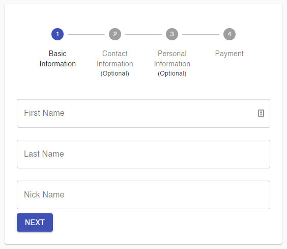
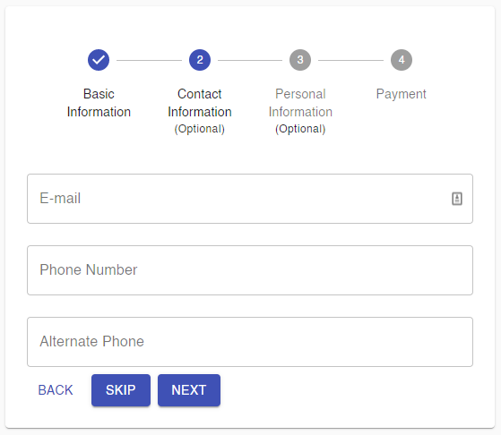
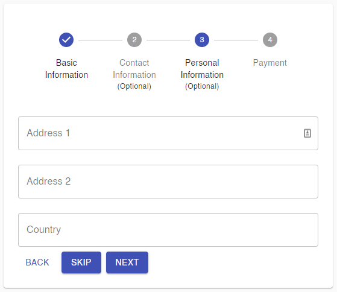
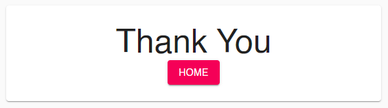

#<h1 align="center>React Stepper Form with React-hook-form</h1>

## Table of Contents

---

1. [General Info](#general-info)
2. [Technologies](#technologies)
3. [Installation](#installation)
4. [Collaboration](#collaboration)
5. [FAQs](#faqs)

### General Info

---

This project aims at creating a simple stepper user form for practice purpose to understand the react, material-ui and react-hook-form.

### Screenshot

---

#### Basic Information Page



#### Contact Information Page



#### Personal Information Page



#### Payment Information Page


#### Thanks Page



## Technologies

---

A list of technologies used within the project:

- [React.js](https://reactjs.org/): Version 17.0.2
- [Material-UI](https://material-ui.com/): Version 4.12
- [React-hook-form](https://react-hook-form.com/): Version 7.14.2

## Installation

---

A little intro about the installation.

```
$ git clone https://github.com/gopeshwark/react-stepper-form-rhk.git
$ cd ./react-stepper-form-rhk.git
$ npm install
$ npm start
```
